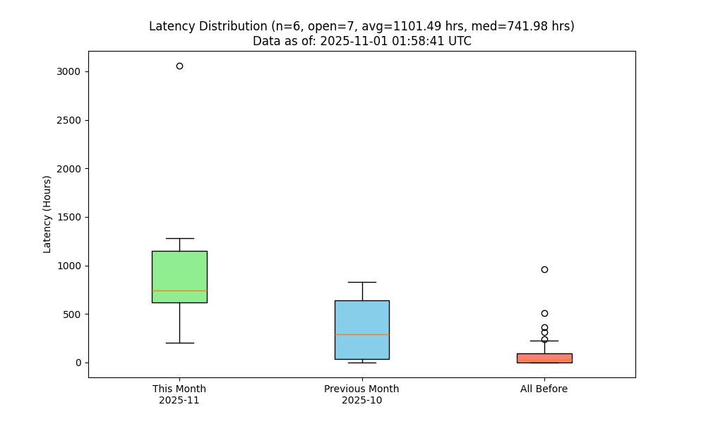

## PR Lifecycle Analysis

We accumulate data about PR lifecycle times for PRs in the google/xls repository. The data includes key timestamps such as when a PR is created, when a review is requested (with CI passing), when the "reviewing internally" label is applied, and when the PR is finally closed (either merged or manually closed).

Two Python scripts are used in this project:

- accumulate_pr_data.py: Fetches PRs from github.com/google/xls, processes timeline events, and writes the relevant data to pr_data.csv.
- plot_pr_delays.py: Reads pr_data.csv, filters for PRs from xlsynth/xlsynth, calculates delays between lifecycle events, and produces a matplotlib boxplot which is saved as pr_delays.png.

To generate the report:

1. Set your GITHUB_TOKEN environment variable.
2. Run:

    python accumulate_pr_data.py
    python plot_pr_delays.py

The following diagram shows the typical PR delays for PRs originating from the xlsynth/xlsynth repository:

