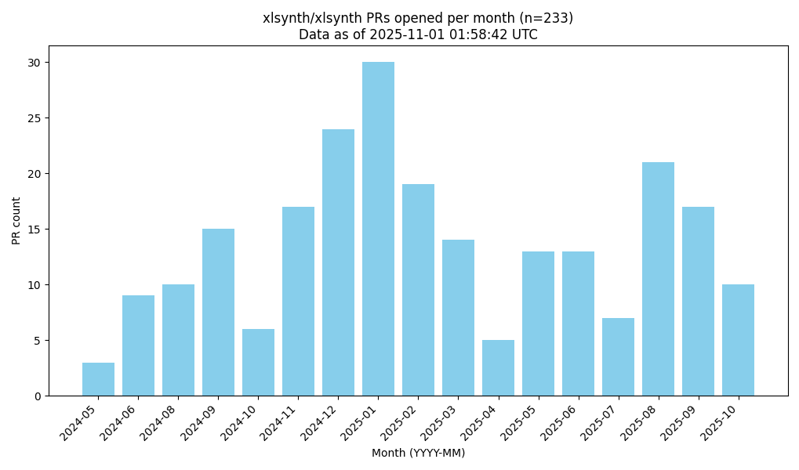

## PR Lifecycle Analysis

We accumulate data about PR lifecycle times for PRs in the google/xls repository. The data includes key timestamps such as when a PR is created, when a review is requested (with CI passing), when the "reviewing internally" label is applied, and when the PR is finally closed (either merged or manually closed).

Three Python scripts are used in this project:

- accumulate_pr_data.py: Fetches PRs from github.com/google/xls, processes timeline events, and writes the relevant data to pr_data.csv.
- plot_pr_delays.py: Reads pr_data.csv, filters for PRs from xlsynth/xlsynth, calculates delays between lifecycle events, and produces a matplotlib boxplot which is saved as pr_delays.png.
- plot_pr_counts.py: Reads pr_data.csv, filters for PRs from xlsynth/xlsynth, counts the number of PRs opened each month, and produces a bar chart saved as pr_counts.png.

To generate the report:

1. Set your GITHUB_TOKEN environment variable.
2. Run:

   ```shell
   python update_all.py
   ```

The following diagram shows the typical PR delays for PRs originating from the xlsynth/xlsynth repository:


And here is the monthly count of those PRs:



### Links to XLSynth PRs by Month

Below is a list of all pull-requests that originated from `xlsynth/xlsynth`, grouped by the month in which they were opened. The list is regenerated automatically by `generate_pr_links_table.py`.

<!-- PR_LINKS_TABLE_START -->
| Month | PRs |
| ----- | ---- |
| 2024-05 | [#1393](https://github.com/google/xls/pull/1393) [#1435](https://github.com/google/xls/pull/1435) [#1443](https://github.com/google/xls/pull/1443) |
| 2024-06 | [#1458](https://github.com/google/xls/pull/1458) [#1460](https://github.com/google/xls/pull/1460) [#1483](https://github.com/google/xls/pull/1483) [#1484](https://github.com/google/xls/pull/1484) [#1492](https://github.com/google/xls/pull/1492) [#1496](https://github.com/google/xls/pull/1496) [#1497](https://github.com/google/xls/pull/1497) [#1499](https://github.com/google/xls/pull/1499) [#1501](https://github.com/google/xls/pull/1501) |
| 2024-08 | [#1529](https://github.com/google/xls/pull/1529) [#1535](https://github.com/google/xls/pull/1535) [#1544](https://github.com/google/xls/pull/1544) [#1545](https://github.com/google/xls/pull/1545) [#1546](https://github.com/google/xls/pull/1546) [#1548](https://github.com/google/xls/pull/1548) [#1554](https://github.com/google/xls/pull/1554) [#1562](https://github.com/google/xls/pull/1562) [#1563](https://github.com/google/xls/pull/1563) [#1564](https://github.com/google/xls/pull/1564) |
| 2024-09 | [#1578](https://github.com/google/xls/pull/1578) [#1588](https://github.com/google/xls/pull/1588) [#1594](https://github.com/google/xls/pull/1594) [#1595](https://github.com/google/xls/pull/1595) [#1602](https://github.com/google/xls/pull/1602) [#1604](https://github.com/google/xls/pull/1604) [#1605](https://github.com/google/xls/pull/1605) [#1606](https://github.com/google/xls/pull/1606) [#1607](https://github.com/google/xls/pull/1607) [#1612](https://github.com/google/xls/pull/1612) [#1620](https://github.com/google/xls/pull/1620) [#1621](https://github.com/google/xls/pull/1621) [#1622](https://github.com/google/xls/pull/1622) [#1627](https://github.com/google/xls/pull/1627) [#1640](https://github.com/google/xls/pull/1640) |
| 2024-10 | [#1648](https://github.com/google/xls/pull/1648) [#1649](https://github.com/google/xls/pull/1649) [#1661](https://github.com/google/xls/pull/1661) [#1665](https://github.com/google/xls/pull/1665) [#1666](https://github.com/google/xls/pull/1666) [#1672](https://github.com/google/xls/pull/1672) |
| 2024-11 | [#1689](https://github.com/google/xls/pull/1689) [#1692](https://github.com/google/xls/pull/1692) [#1694](https://github.com/google/xls/pull/1694) [#1699](https://github.com/google/xls/pull/1699) [#1700](https://github.com/google/xls/pull/1700) [#1706](https://github.com/google/xls/pull/1706) [#1707](https://github.com/google/xls/pull/1707) [#1709](https://github.com/google/xls/pull/1709) [#1720](https://github.com/google/xls/pull/1720) [#1723](https://github.com/google/xls/pull/1723) [#1724](https://github.com/google/xls/pull/1724) [#1725](https://github.com/google/xls/pull/1725) [#1737](https://github.com/google/xls/pull/1737) [#1740](https://github.com/google/xls/pull/1740) [#1751](https://github.com/google/xls/pull/1751) [#1753](https://github.com/google/xls/pull/1753) [#1754](https://github.com/google/xls/pull/1754) |
| 2024-12 | [#1755](https://github.com/google/xls/pull/1755) [#1758](https://github.com/google/xls/pull/1758) [#1774](https://github.com/google/xls/pull/1774) [#1775](https://github.com/google/xls/pull/1775) [#1777](https://github.com/google/xls/pull/1777) [#1780](https://github.com/google/xls/pull/1780) [#1785](https://github.com/google/xls/pull/1785) [#1790](https://github.com/google/xls/pull/1790) [#1791](https://github.com/google/xls/pull/1791) [#1792](https://github.com/google/xls/pull/1792) [#1793](https://github.com/google/xls/pull/1793) [#1799](https://github.com/google/xls/pull/1799) [#1800](https://github.com/google/xls/pull/1800) [#1801](https://github.com/google/xls/pull/1801) [#1802](https://github.com/google/xls/pull/1802) [#1807](https://github.com/google/xls/pull/1807) [#1808](https://github.com/google/xls/pull/1808) [#1809](https://github.com/google/xls/pull/1809) [#1812](https://github.com/google/xls/pull/1812) [#1816](https://github.com/google/xls/pull/1816) [#1817](https://github.com/google/xls/pull/1817) [#1818](https://github.com/google/xls/pull/1818) [#1819](https://github.com/google/xls/pull/1819) [#1820](https://github.com/google/xls/pull/1820) |
| 2025-01 | [#1822](https://github.com/google/xls/pull/1822) [#1823](https://github.com/google/xls/pull/1823) [#1824](https://github.com/google/xls/pull/1824) [#1825](https://github.com/google/xls/pull/1825) [#1827](https://github.com/google/xls/pull/1827) [#1828](https://github.com/google/xls/pull/1828) [#1829](https://github.com/google/xls/pull/1829) [#1832](https://github.com/google/xls/pull/1832) [#1837](https://github.com/google/xls/pull/1837) [#1839](https://github.com/google/xls/pull/1839) [#1842](https://github.com/google/xls/pull/1842) [#1849](https://github.com/google/xls/pull/1849) [#1864](https://github.com/google/xls/pull/1864) [#1865](https://github.com/google/xls/pull/1865) [#1869](https://github.com/google/xls/pull/1869) [#1871](https://github.com/google/xls/pull/1871) [#1873](https://github.com/google/xls/pull/1873) [#1878](https://github.com/google/xls/pull/1878) [#1880](https://github.com/google/xls/pull/1880) [#1881](https://github.com/google/xls/pull/1881) [#1882](https://github.com/google/xls/pull/1882) [#1884](https://github.com/google/xls/pull/1884) [#1886](https://github.com/google/xls/pull/1886) [#1887](https://github.com/google/xls/pull/1887) [#1888](https://github.com/google/xls/pull/1888) [#1889](https://github.com/google/xls/pull/1889) [#1890](https://github.com/google/xls/pull/1890) [#1891](https://github.com/google/xls/pull/1891) [#1894](https://github.com/google/xls/pull/1894) [#1901](https://github.com/google/xls/pull/1901) |
| 2025-02 | [#1902](https://github.com/google/xls/pull/1902) [#1905](https://github.com/google/xls/pull/1905) [#1910](https://github.com/google/xls/pull/1910) [#1915](https://github.com/google/xls/pull/1915) [#1919](https://github.com/google/xls/pull/1919) [#1921](https://github.com/google/xls/pull/1921) [#1922](https://github.com/google/xls/pull/1922) [#1923](https://github.com/google/xls/pull/1923) [#1924](https://github.com/google/xls/pull/1924) [#1931](https://github.com/google/xls/pull/1931) [#1935](https://github.com/google/xls/pull/1935) [#1938](https://github.com/google/xls/pull/1938) [#1944](https://github.com/google/xls/pull/1944) [#1946](https://github.com/google/xls/pull/1946) [#1947](https://github.com/google/xls/pull/1947) [#1948](https://github.com/google/xls/pull/1948) [#1965](https://github.com/google/xls/pull/1965) [#1966](https://github.com/google/xls/pull/1966) [#1967](https://github.com/google/xls/pull/1967) |
| 2025-03 | [#1971](https://github.com/google/xls/pull/1971) [#1972](https://github.com/google/xls/pull/1972) [#1977](https://github.com/google/xls/pull/1977) [#1978](https://github.com/google/xls/pull/1978) [#1984](https://github.com/google/xls/pull/1984) [#1987](https://github.com/google/xls/pull/1987) [#1989](https://github.com/google/xls/pull/1989) [#1991](https://github.com/google/xls/pull/1991) [#1994](https://github.com/google/xls/pull/1994) [#2003](https://github.com/google/xls/pull/2003) [#2007](https://github.com/google/xls/pull/2007) [#2013](https://github.com/google/xls/pull/2013) [#2015](https://github.com/google/xls/pull/2015) [#2024](https://github.com/google/xls/pull/2024) |
| 2025-04 | [#2066](https://github.com/google/xls/pull/2066) [#2067](https://github.com/google/xls/pull/2067) [#2070](https://github.com/google/xls/pull/2070) [#2072](https://github.com/google/xls/pull/2072) [#2080](https://github.com/google/xls/pull/2080) |
| 2025-05 | [#2096](https://github.com/google/xls/pull/2096) [#2110](https://github.com/google/xls/pull/2110) [#2158](https://github.com/google/xls/pull/2158) [#2177](https://github.com/google/xls/pull/2177) [#2210](https://github.com/google/xls/pull/2210) [#2219](https://github.com/google/xls/pull/2219) [#2240](https://github.com/google/xls/pull/2240) [#2241](https://github.com/google/xls/pull/2241) [#2251](https://github.com/google/xls/pull/2251) [#2254](https://github.com/google/xls/pull/2254) [#2262](https://github.com/google/xls/pull/2262) [#2310](https://github.com/google/xls/pull/2310) [#2311](https://github.com/google/xls/pull/2311) |
| 2025-06 | [#2329](https://github.com/google/xls/pull/2329) [#2357](https://github.com/google/xls/pull/2357) [#2369](https://github.com/google/xls/pull/2369) [#2374](https://github.com/google/xls/pull/2374) [#2396](https://github.com/google/xls/pull/2396) [#2397](https://github.com/google/xls/pull/2397) [#2400](https://github.com/google/xls/pull/2400) [#2417](https://github.com/google/xls/pull/2417) [#2424](https://github.com/google/xls/pull/2424) [#2427](https://github.com/google/xls/pull/2427) [#2449](https://github.com/google/xls/pull/2449) [#2451](https://github.com/google/xls/pull/2451) [#2476](https://github.com/google/xls/pull/2476) |
| 2025-07 | [#2569](https://github.com/google/xls/pull/2569) [#2589](https://github.com/google/xls/pull/2589) [#2594](https://github.com/google/xls/pull/2594) [#2601](https://github.com/google/xls/pull/2601) [#2646](https://github.com/google/xls/pull/2646) [#2672](https://github.com/google/xls/pull/2672) [#2704](https://github.com/google/xls/pull/2704) |
<!-- PR_LINKS_TABLE_END -->
